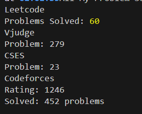

# my-first-web-scraping

This is still now dynamic. You can only see my CP Profiles 😉...

## Installation

**Prerequisites:**

- **Node.js:** Ensure you have Node.js (version 14 or higher) installed on your system. If not, download and install it from the official Node.js website: [https://nodejs.org/](https://nodejs.org/)

1. Clone the repository:
   ```bash
   git clone https://github.com/its-asif/my-first-web-scraping.git
   ```
2. Install dependencies:
   ```bash
   npm install
   ```
3. Create a .env file and enter your username and cookie(where needed)
   ```
   CODEFORCES_USERNAME=
   VJUDGE_USERNAME=
   LEETCODE_USERNAME=
   CSES_USERNAME=
   CSES_PHPSESSID=
   ```

   copy from here or check `.env.example` file and fill those field and copy paste into .env file

## Running Locally

1. Start the development server:
   ```bash
   node final.js
   ```

